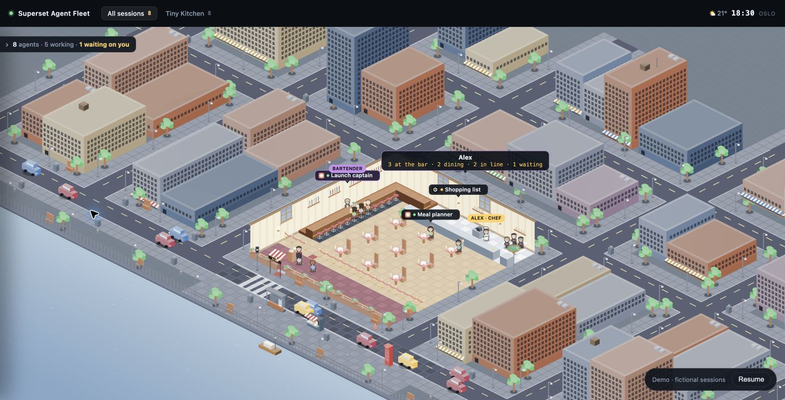
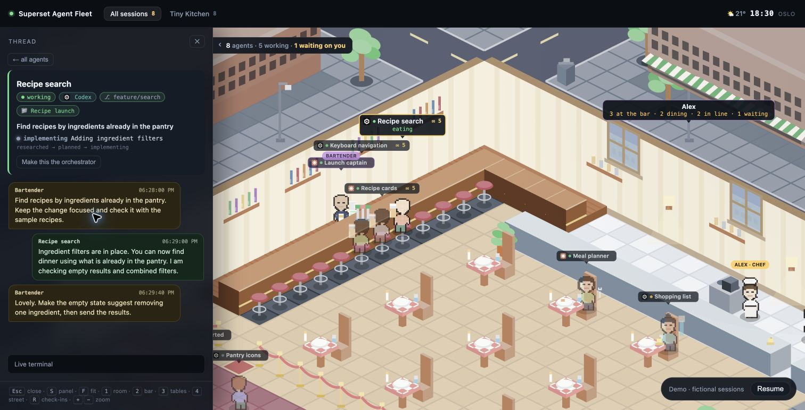

# Superset Agent Fleet

Your coding agents, running a tiny restaurant.

A pixel-art view of your [Superset](https://superset.sh) workspaces. Orchestrators
work the bar, their workers take the stools, and independent agents sit at tables.
When someone needs you, they raise a hand.



Run it on localhost with your own Superset account. No hosted account, database,
or API key is needed for Agent Fleet itself.

[Quickstart](#quickstart) · [Local setup](docs/local-setup.md) · [How it works](docs/architecture.md) · [Contributing](CONTRIBUTING.md)

## Quickstart

You need [Bun](https://bun.sh) 1.3.14 or newer, Git, and the Superset app and CLI, signed in to your
own account with the local host running. Check that `superset status` works in
terminal first.

```sh
git clone https://github.com/skriptr-ai/superset-agent-fleet.git
cd superset-agent-fleet
bun start
```

Open **http://localhost:4400**. Stop the server with `Ctrl+C`.

There are no runtime packages to install and no build step. The default view reads
this machine's Superset workspaces. Start an agent in Superset to give it a seat.
An account with no agent sessions gets an empty restaurant.

If setup gets stuck:

```sh
bun run doctor
```

See [local setup and troubleshooting](docs/local-setup.md) for configuration,
platform notes, and the optional background service.

## Take a look without connecting Superset

```sh
bun run demo
```

Open the URL printed in your terminal. The demo uses fictional agents and
conversations, and needs no Superset login. The screenshots in this README come
from that demo.

## What happens in the restaurant?

| In the scene                 | In your fleet                                 |
| ---------------------------- | --------------------------------------------- |
| Bartender                    | An orchestrator coordinating other sessions   |
| Workers on bar stools        | The sessions that orchestrator drives         |
| Diners at tables             | Independent agents working for you            |
| People in the queue          | Resting sessions, waiting for their next turn |
| A raised hand and `!`        | An agent waiting for your input               |
| Drinks and plates in transit | Observed messages and turn activity           |

Hover over an agent for a quick status. Click to open its conversation and terminal
screen. Filter by project in the top bar. If an orchestrator has not been detected,
you can pin it from its drawer.



Scroll to zoom, drag to pan, and press `F` to fit the scene. `S` opens the agent
panel and `Esc` closes it. The drawer lists the remaining shortcuts.

The city follows a clock, daylight, and optional real weather. Oslo is the default;
[make it your town](docs/local-setup.md#configuration) if you like.

## Your data

The live view reads terminal screens and relevant local Claude Code transcripts
to reconstruct activity and conversations. That content can contain private code,
prompts, paths, and secrets printed by your tools. Be careful when sharing your
screen; use the demo for public screenshots.

The server listens on localhost and uploads no fleet reports with the default
configuration. Superset can make its own network requests. Weather is fetched from
`api.met.no` for the configured coordinates; set `AGENT_FLEET_WEATHER=off` to
turn it off. See [privacy and local storage](docs/local-setup.md#privacy-and-local-storage).

## A place for the whole team

A free web app for connecting your entire team or organization's Superset workspaces is coming soon.

The open-source version documented here runs on localhost. The repository also
contains code for our existing internal deployment; you do not need it to get started.

## Contribute

Help us improve agent detection, add something to the street, or make the docs
clearer. [CONTRIBUTING.md](CONTRIBUTING.md) explains the workflow.

For contributors:

```sh
bun install
bun test
bun run check
```

Found a bug or have an idea? [Open an issue](https://github.com/skriptr-ai/superset-agent-fleet/issues).
For a security problem, please follow [SECURITY.md](SECURITY.md).

## License and credits

[MIT](LICENSE). Built by [Skriptr](https://skriptr.ai) for people using Superset.
This is an independent community project, not an official Superset product.
The pixel art is drawn in code. Optional weather data comes from the
[Norwegian Meteorological Institute](https://www.met.no/en).
