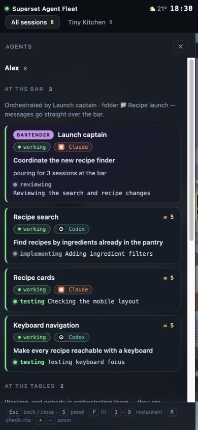

# Robustness review — September 15, 2026

This review covers local setup, Superset discovery and observation, failure
recovery, the browser drawer, and rendering. It uses fictional data for fault
injection and browser checks, plus bounded read-only checks against a real Mac
and an existing development VM.

## Fixes

- Failed terminal or host reads retain the last successful observation. They no
  longer imply disappearance, completion, or a fresh spawn on recovery.
- Discovery distinguishes unavailable hosts from removed hosts, including when
  all remaining hosts fail. Exited terminals do not require a readable dead PTY.
- Empty-host identity can recover when its first workspace appears. Local hook
  bindings and terminal call counters cannot collide with another host's terminal.
- Idle and exited remote sessions rotate fairly. Background metadata leaves CLI
  capacity for foreground reads; concurrency one disables background discovery.
- Private transport can recover after endpoint/token changes. The CLI version
  startup check has a deadline. Deferred relationship evidence expires and is bounded.
- Custom Superset profiles own their default state and send log. Service definitions
  exclude ambient agent context, use private file permissions, and preserve literal paths.
- Connection notices survive filtering; stale sessions have explicit labels.
  Drawer updates preserve focus, selection and scroll. The mobile header fits a
  narrow viewport. An empty initial district no longer crashes the renderer.
- The renderer reuses its visible city plan while the camera and district are unchanged.

## Evidence

### Local automated checks

`bun test` passed 195 tests with one skipped Linux-only `systemd-analyze` check.
Fixtures exercise the real HTTP server and CLI process limiter as well as parsing
and world state. They use temporary home directories and invented conversations.
Formatting, shell syntax, whitespace checks, and a redacted working-tree secret
scan passed. A generated macOS service plist passed `plutil -lint`.

### Browser checks

The manual fixture server is documented in [Contributing](../CONTRIBUTING.md).
Checks cover partial and stale observations, filtering during an error, empty
startup, recovery, selected-session removal, keyboard navigation, pinning, and
the drawer at 390 × 844. The narrow page's scroll width equals its viewport width.
The DOM regression page verifies retained nodes, focus, selected text, scroll,
and cached versus freshly built city pixels at three animation times.

### Rendering measurements

Three paired 240-frame sample windows used the same eight-agent fictional scene,
camera and desktop viewport. Frame CPU medians were:

| Sample | Before | With city-plan cache |
| ------ | ------ | -------------------- |
| 1      | 4.7 ms | 4.4 ms               |
| 2      | 4.7 ms | 4.4 ms               |
| 3      | 5.1 ms | 4.7 ms               |

These samples show a modest median CPU reduction. Frame cadence stayed at 8.3 ms;
p95 CPU time did not improve consistently. This is a local browser observation,
not a GPU benchmark or a promise for other machines. Add `?debug=1` to reproduce
measurements with your own scene.

### Live integration

With Bun 1.3.14 and Superset CLI 1.28.0, local discovery returned 19 workspaces.
A full isolated local poll observed 15 agents with no stale reads or errors.
A subsequent poll after the queue changes observed 14 agents, also without
stale reads or errors; the live fleet changed during the review.
Terminal listing and reading also succeeded for one workspace on an existing
development VM. No messages were sent and no live sessions or services were changed.

## Limits and follow-up

- Linux service installation and new VM/sandbox provisioning were not performed.
  The Linux service-parser test is ready for an environment with systemd.
- Host restart, token rotation and network failures were injected in tests; running
  Superset hosts were not restarted to reproduce them live.
- Remote transcript enrichment requires a collector on that machine. Terminal
  scraping remains best-effort and cannot recover text that was never observed.
- Windows live integration and long-running soak/load testing remain unverified.
- The existing hosted deployment was not changed or deployed during this review.
